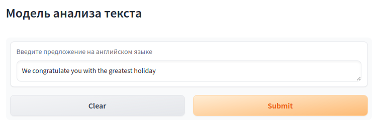
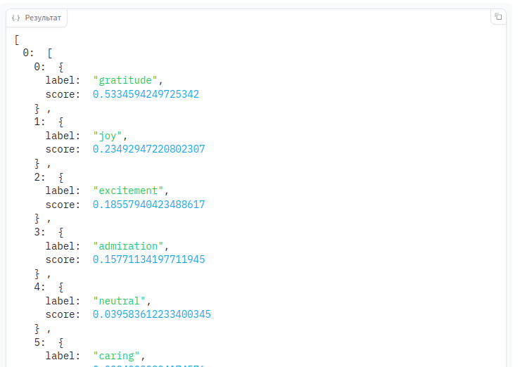

# Практическая работа №3

## В рамках работы было выполнено следующее:

1. Подготовлен python код для модели и микросервиса.
2. Создан Dockerfile.
3. Создан docker образ.
4. Запущен docker контейнер и проверена его работа.

## Проверка работоспособности

Для сборки образа необходимо выполнить команду:
```
docker build . -t lab3:0.0.3
```

Для запуска контейнера выполнить команду:
```
docker run -p 7860:7860 lab3:0.0.1
```

Для проверки перейти в браузер  ввести адрес http://localhost:7860/

В форме web-приложения ввести предложение на английском языке и нажать Submit:


В окне справа увидим результат анализа текста:
